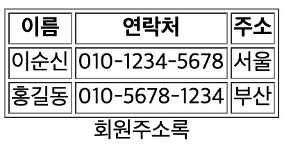
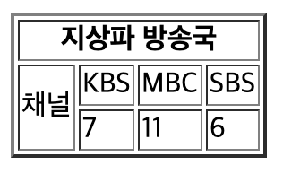
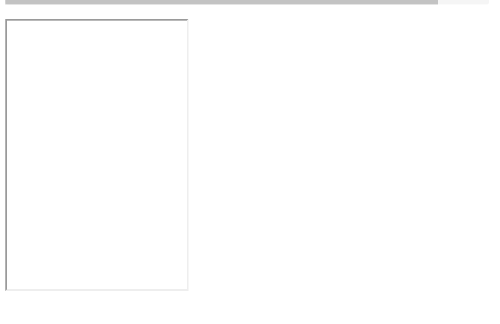

# HTML


## Table of Contents
  - [Basic Format](#basic-format)
  - [Spacing](#spacing)
  - [문자 사용](#문자-사용)
  - [특수 문자](#특수-문자)
  - [p테그, span태그, div태그](#p-span-div)
  - [이미지, 비디오, 오디오](#이미지-비디오-오디오)
  - [리스트](#리스트)
  - [링크](#링크)
  - [테이블](#테이블)
  - [iframe](#iframe)
  - [Form Input](#form-input)

---

## Basic Format

```html
<!DOCTYPE html>
<html>

<head>
    <meta charset="UTF-8">
    <title>
        Insert title here
    </title>
</head>

<body>
    Hello World
</body>

</html>
```

---

## Spacing
- ```<br>```: = ```\n```
- ```&nbsp;```: = ```\t```
- ```<pre>``` = 있는 그대로를 표시 (\``` \```) 와 비슷
    ```html
    <pre>
        있는 그대로를 표시한다.
    </pre>
    ```
    <pre>
        있는 그대로를 표시한다.
    </pre>

---

## 문자 사용
- ```<b>```: 굵은 글꼴
- ```<i>```: 기울임 꼴
- ```<em>```: 강조
- ```<small>```: 작은 글자
- ```<mark>```: 하이라이트
- ```<strong>```: 글자 강력하게 강조
- ```<sub>```: 아래 첨자
- ```<sup>```: 윗 첨자
- ```<ins>```: 밑줄
- ```<del>```: 취소 줄

```html
<body>
    <p><b> b 태그는 굵은 글꼴입니다.</b></p>
    <p><i> i 태그는 기울임 꼴입니다.</i> </p>
    <p><em> em 태그는 강조로 표시합니다.</em> </p>
    <p><small> small 태그는 작은 글자를 표시합니다.</small> </p>
    <p><mark> mark 태그는 음영 </mark>으로 표시합니다.</p>
    <p><strong> strong 태그는 문자를 강력하게 강조합니다.</strong> </p>
    <p>X<sub>2</sub>(아래 첨자) 와 Y<sup>2</sup>(위 첨자)입니다. </p>
    <p>ins 태그는 <ins>추가한 내용을 밑줄</ins>로 표시합니다.</p>
    <p><del>del 태그는 취소선을 표시합니다.</del> </p>
    <p>X<sup>2</sup> + Y<sup>2</sup> = Z<sup>2</sup> </p>
</body>
```

<body>
    <p><b> b 태그는 굵은 글꼴입니다.</b></p>
    <p><i> i 태그는 기울임 꼴입니다.</i> </p>
    <p><em> em 태그는 강조로 표시합니다.</em> </p>
    <p><small> small 태그는 작은 글자를 표시합니다.</small> </p>
    <p><mark> mark 태그는 음영 </mark>으로 표시합니다.</p>
    <p><strong> strong 태그는 문자를 강력하게 강조합니다.</strong> </p>
    <p>X<sub>2</sub>(아래 첨자) 와 Y<sup>2</sup>(위 첨자)입니다. </p>
    <p>ins 태그는 <ins>추가한 내용을 밑줄</ins>로 표시합니다.</p>
    <p><del>del 태그는 취소선을 표시합니다.</del> </p>
    <p>X<sup>2</sup> + Y<sup>2</sup> = Z<sup>2</sup> </p>
</body>

---

## 특수 문자

- ```&nbsp;```: 공백
- ```&lt;```: less than
- ```&gt;```: greater than
- ```&amp;```: &
- ```&cent;```: cent 표시
- ```&pound;```: pound 표시
- ```&yen;```: yen 표시
- ```&euro;```: euro 표시
- ```&sect;```: section 표시
- ```&copy;```: copyright 표시
- ```&reg;```: registered trademark 표시

```html
<body>
	<p>space: &nbsp;  (공백)</p>
	<p>less than: &lt;</p>     
	<p>greater than: &gt; </p>  
	<p>ampersand: &amp;</p>    
	<p>cent: &cent; </p>
	<p>pound: &pound; </p>
	<p>yen: &yen;</p>
	<p>euro: &euro; </p>
	<p>section: &sect; </p>
	<p>copyright: &copy; </p>
	<p>registered trademark: &reg; </p>
</body>
```
<body>
	<p>space: &nbsp;  (공백)</p>
	<p>less than: &lt;</p>     
	<p>greater than: &gt; </p>  
	<p>ampersand: &amp;</p>    
	<p>cent: &cent; </p>
	<p>pound: &pound; </p>
	<p>yen: &yen;</p>
	<p>euro: &euro; </p>
	<p>section: &sect; </p>
	<p>copyright: &copy; </p>
	<p>registered trademark: &reg; </p>
</body>

---

## p, span, div
- ```div```: 칸에 맞게 빽빽히 스택을 쌓아놓는다.
- ```p```: div 칸끼리 사이에 공백을 추가한다.
- ```span```: 그냥 글 사이즈에 알 맞게 집어넣는다.

```html
<body>
    div
    <div style="background-color: orange;">12345</div>
    <div style="background-color: yellow;">ABCD</div>
    <div style="background-color: green;">가나다라</div>
    <br>
    p
    <p style="background-color: orange;">12345</p>
    <p style="background-color: yellow;">가나다라</p>
    <p style="background-color: green;">ABCD</p>
    <br>
    span
    <span style="background-color: orange;">12345</span>
    <span style="background-color: yellow;">ABCD</span>
    <span style="background-color: green;">가나다라</span>
</body>
```

<body>
    div
    <div style="background-color: orange;">12345</div>
    <div style="background-color: yellow;">ABCD</div>
    <div style="background-color: green;">가나다라</div>
    <br>
    p
    <p style="background-color: orange;">12345</p>
    <p style="background-color: yellow;">가나다라</p>
    <p style="background-color: green;">ABCD</p>
    <br>
    span
    <span style="background-color: orange;">12345</span>
    <span style="background-color: yellow;">ABCD</span>
    <span style="background-color: green;">가나다라</span>
</body>

---

# 이미지 비디오 오디오
- **이미지**
    ``````
    - ```src```: 이미지 주소
    - ```width```: 가로길이
    - ```height```: 세로길이
    - ```alt```: 이미지가 없을때 나오는 문구

    ```html
    <body>
        
        
        
    </body>
    ```

    <body>
        
        
        
    </body>

    <br><br>

    - ```figure```: 이미지 그룹으로 묶어준다.
    - ```figcaption```: 그림의 제목


    ```html
    <body>
    <figure>
        
        <figcaption>[그림 1-1] w3c 공식 사이트 </figcaption>
    </figure>
    </body> 
    ```

    <body>
    <figure>
        
        <figcaption>[그림 1-1] w3c 공식 사이트 </figcaption>
    </figure>
    </body>


---

## 리스트
- ```<ul>```: 오더가 없는 리스트 (circle, square, disc, none)
- ```<ol>```: 순서가 있는 리스트 (1. 2. 3.. ...)

    ```html
    <body>
    <!-- type: circle, square, disc, none -->
    <ul type="disc">
        <li>카페라떼</li>
        <li>아메리카노</li>
        <li>콜드브루</li>
    </ul>

    <!-- type: "1", "A" "I"
    reversed : 거꾸로
    start : 시작점 -->
    <ol type="1" start="50", reversed>
        <li>카페라떼</li>
        <li>아메리카노</li>
        <li>콜드브루</li>
    </ol>
    </body>
    ```

    <body>
    <!-- circle, square, disc, none -->
    <ul type="disc">
        <li>카페라떼</li>
        <li>아메리카노</li>
        <li>콜드브루</li>
    </ul>

    <!-- type: "1", "A" "I"
    reversed : 거꾸로
    start : 시작점 -->
    <ol type="1" start="50", reversed>
        <li>Cafe Latte</li>
        <li>Americano</li>
        <li>Cold Brew</li>
    </ol>
    </body>

- ```<dl><dt><dd>```: 탭을 사용하여 리스트를 나타낸다
    ```html
    <body>
        <dl>
            <dt>HTML</dt>
            <dd>Hyper Text Markup Language</dd>

            <dt>CSS</dt>
            <dd>Cascading Style Sheet</dd>
        </dl>
    </body>
    ```

    <body>
        <dl>
            <dt>HTML</dt>
            <dd>Hyper Text Markup Language</dd>
            <dt>CSS</dt>
            <dd>Cascading Style Sheet</dd>
        </dl>
    </body>

---

## 링크

- ```target="_top:```: 해당 페이지가 링크로 바뀐다.
- ```target="_blank:```: 새 페이지에서 링크가 열린다.
- ```target="_self:```: 버튼을 소유하고 있는 칸에서 화면이 나온다.
```html
<body>
    <a href="http://www.w3c.org" target="_top">W3C</a>

    <br>

    <a href="ex01_01.html" target="_blank">1 페이지로 이동</a>
    <a href="ex01_02.html" target="_blank">
        
    </a>
</body>
```

<body>
    <a href="http://www.w3c.org" target="_top">W3C</a>
    <br>
    <a href="http://www.facebook.com" target="_blank">페이스북 페이지로 이동</a>
    <br>
    <a href="http://www.naver.com" target="_blank">
        
    </a>
</body>

--- 

## 테이블
- ```tr```: 테이블 row, 한줄
- ```th```: 테이블 헤드
- ```td```: 테이블의 도큐먼트
- ```thead```:  테이블 위에 둔다
- ```tfoot```:  테이블 맨밑으로 옮긴다.
- ```tbody```:  테이블의 몸둥아리
- ```colspan```: 가로를 병합
- ```rowspan```: 세로를 병합
```html
<body>
<table border="1">
    <caption align="bottom">회원주소록</caption>
    <tr>
        <th>이름</th>
        <th>연락처</th>
        <th>주소</th>
    </tr>
    <tr>
        <td>이순신</td>
        <td>010-1234-5678</td>
        <td>서울</td>
    </tr>
    <tr>
        <td>홍길동</td>
        <td>010-5678-1234</td>
        <td>부산</td>
    </tr>
</table>
</body>
```



```html
<body>
<table border="2">
    <tr>
        <th colspan="4">지상파 방송국</th>
    </tr>
    <tr>
        <td rowspan="2">채널</td>
        <td>KBS</td>
        <td>MBC</td>
        <td>SBS</td>
    </tr>
    <tr>
        <td>7</td>
        <td>11</td>
        <td>6</td>
    </tr>
</table>
</body>
```



---

## iframe
- ```iframe```: html에서 일정한 영역을 할당해서 삽입하는 프레임

```html
<body>
    <!-- iframe: html에서 일정한 영역을 할당해서 삽입하는 프레임 -->
    <iframe src="http://www.facebook.com" width="200px" height="300px">
        <p>이 브라우저는 iframe을 지원하지 않습니다.</p>
    </iframe>
</body>
```



---

## Form Input 

Form: 정보를 입력 또는 선택하고 버튼을 클릭하며 정보를 서버에 전달하고 응답 받는 양방향의 의사소통을 지원하는 입력양식.

***INPUT***
```html
<body>
    <form action="idOk.html" method="get">
        아이디: <input type="text" name="id" size="20">
        비밀번호: <input type="text" name="pwd" size="20">
        <input type="button" value="목록">
        <input type="submit" value="전송">
        <input type="reset" value="취소">
    </form>
</body>
```

```html
<body>
나의 아이디는 admin이고<br>
비밀번호는 1234입니다.<br>
<a href="ex01_18.html">이전으로</a>
</body>
```


**form의 method**
> 클라이언트의 데이터를 서버로 보내기 위한 방법을 설정합니다. get(기본값)은 폼의 내용을 서버로 전송할 때 255바이트 이하까지 만 전송할 수 있고 주소표시줄에 전송되는 값이 노출됩니다. post은 폼의 내용을 서버로 전송할 때 255바이트보다 크거나 보안 이 필요한 데이터를 보낼 때 설정합니다.
- ```method="get"``` = Query에 그대로 아이디를 가져온다
  - ```http://127.0.0.1:5500/WebContent/idOk.html?id=admin&pwd=1234```
- ```method="post"``` = Query에 정보를 표시 하지 않는다.
  - ```http://127.0.0.1:5500/WebContent/idOk.html```

:arrow_right: 전송을 누르면, idOk.html로 이동을 한다.

**input의 type**
- ```button```
- ```submit```
- ```cancel```
- ```checkbox```
- ```radio```

ex01_\#19, ex01_\#20

---

## label, for 을 이용한 연결

- ```label```: 요소간 연결관계를 설정한다.
- ```for```: 연결하려는 태그의 id를 지정한다.

```html
<body>
    <!-- label: 요소간 연결관계를 설정한다
    for  : 연결하려는 태그의 id를 지정한다. -->
    이름: <input type="text" name="name"><br><br>                <!-- 1 -->
    
    <label>이름: <input type="text" name="name"><br><br></label> <!-- 2 -->

    <label for="myName">이름:</label>
    <input type="text" name="name" id="myName">                  <!-- 3 -->   
</body>
```

1번 같은경우, text 박스 안을 눌러야지만 선택이되지만<br>
2,3번은 이름 박스 주변을 클릭해도된다 (\"이름\" 칸을 누르면 선택 된다.)

---

## Radio

--- 

## Div
> section으로 나누어서, ID를 준다. 그러므로 크게 header나, section 이나, article 등으로 나누어서 더 편리하게 사용할 수 있게 도와준다.

ex)

```html
<body>
<div id="header">
	<h1>Web Publisher</h1>
</div>
<div id="nav">
	<ul>
		<li><a href="#"> HTML5 </a>
		<li><a href="#"> CSS3 </a>
		<li><a href="#"> JAVASCRPT </a>
		<li><a href="#"> jQuery </a>
	</ul>
</div>
<div id="section">
	<h2>HTML5이란?</h2>
	<div id="article">1. HTML개요</div>
	<div id="article">2. 문서구조</div>
</div>
<div id="aside">
	<h3>보충설명</h3>
	<p>
		HTML5, CSS3, JavaScript는 front-end입니다<br> PHP, JSP, ASP는
		back-end입니다
	</p>
</div>
<div id="footer">
	<p>address and @copyright</p>
</div>
```