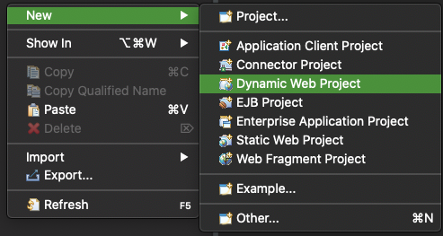
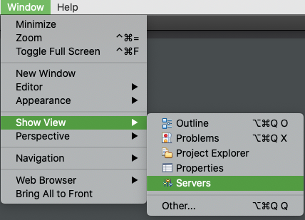
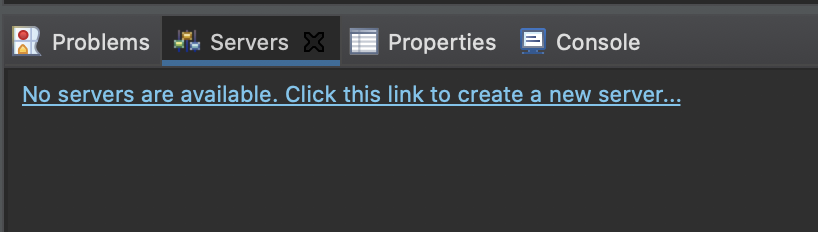
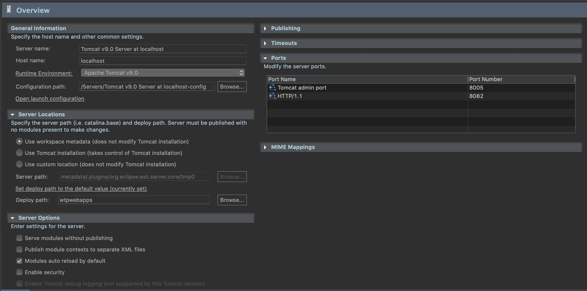

# JSP Setup

1. Create **Dynamic Web Project**
   
2. Window > Show View > Servers --> For Tomcat Server
   
3. create server
   
   then, select that server (ex. `tomcat v 9.0`)

4. customize
   

5. to make specific path, press `command + i` (Properties) > Web Project Settings and change **`Context root`** >> Project Clean

---

### Create Server based Program

#### JAVA File in `src`

New > Servlet
Template

```java

package com.ezen.method;

import java.io.IOException;
import javax.servlet.ServletException;
import javax.servlet.annotation.WebServlet;
import javax.servlet.http.HttpServlet;
import javax.servlet.http.HttpServletRequest;
import javax.servlet.http.HttpServletResponse;

/**
 * Servlet implementation class ex
 */
@WebServlet("/ex")
public class ex extends HttpServlet {
	private static final long serialVersionUID = 1L;

    /**
     * @see HttpServlet#HttpServlet()
     */
    public ex() {
        super();
        // TODO Auto-generated constructor stub
    }

	/**
	 * @see HttpServlet#doGet(HttpServletRequest request, HttpServletResponse response)
	 */
	protected void doGet(HttpServletRequest request, HttpServletResponse response) throws ServletException, IOException {
		// TODO Auto-generated method stub
		response.getWriter().append("Served at: ").append(request.getContextPath());
	}

	/**
	 * @see HttpServlet#doPost(HttpServletRequest request, HttpServletResponse response)
	 */
	protected void doPost(HttpServletRequest request, HttpServletResponse response) throws ServletException, IOException {
		// TODO Auto-generated method stub
		doGet(request, response);
	}

}
```

ex

```java

package com.ezen.method;

import java.io.IOException;
import javax.servlet.ServletException;
import javax.servlet.annotation.WebServlet;
import javax.servlet.http.HttpServlet;
import javax.servlet.http.HttpServletRequest;
import javax.servlet.http.HttpServletResponse;

@WebServlet(name = "POST", urlPatterns = { "/post.do" })
public class PostServlet extends HttpServlet {
	private static final long serialVersionUID = 1L;

	protected void doPost(HttpServletRequest request, HttpServletResponse response) throws ServletException, IOException {
		//1.한글처리(UTF-8, EUC-KR등)
		response.setContentType("text/html;charset=UTF-8");
		request.setCharacterEncoding("UTF-8");  //POST방식의 한글처리

		//2.데이터 가져오기
		String name=request.getParameter("name");
		int score=Integer.parseInt(request.getParameter("score"));
		String result=null;

		if(score>=60)
			result="합격";
		else
			result="불합격";

		//3.출력
		response.getWriter().append("<html><head><title></title></head>");
		response.getWriter().append("<body>");

		response.getWriter().append("이름:" + name +"<br>");
		response.getWriter().append("점수:" + score +"<br>");
		response.getWriter().append("결과:" + result +"<br>");

		response.getWriter().append("<a href='postTest.html'>처음으로</a>");
		response.getWriter().append("</body></html>");
	}
}

```
