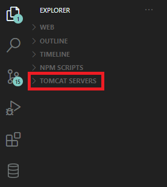
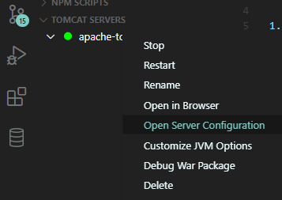
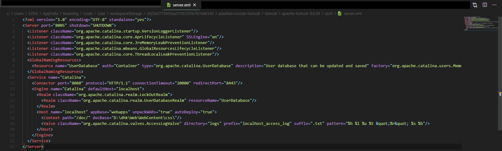
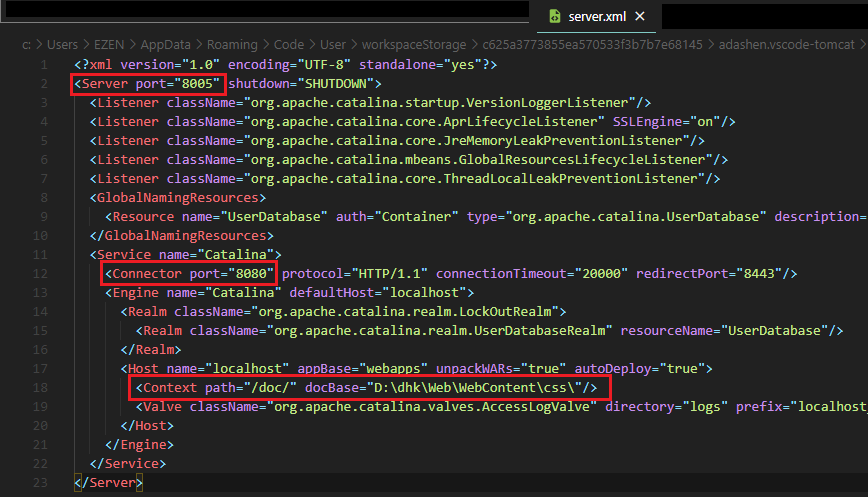
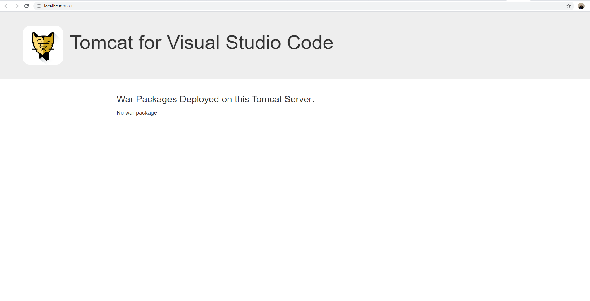
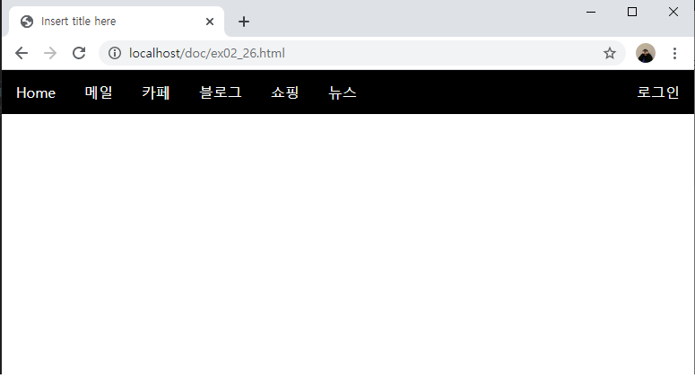

# VSCode Apache-Tomcat 설정 방법

### 설치방법

1. [링크](https://tomcat.apache.org/download-90.cgi)에 가서 apache-tomcat 버전을 다운받는다.
2. vscode로 넘어와서 extension 중 **Tomcat for Java**를 다운받는다.

   - Explorer에 Tomcat servers 가 잘 있는지 확인한다. 없으면 `ctrl+shift+p`누르고 찾는다.
   - 

3. Tomcat Servers에 **+** 사인을 누른뒤, 다운 받았던 apache-tomcat-9.xx 폴더를 불러온다. `select tomcat directory`를 누른다.

### apache-tomcat 설정 방법

1. 설정한 apache-tomcat-9.0.39를 오른쪽 마우스 클릭한뒤, `Open Server Configuration`을 누른다
   
   그 후, `server.xml`이 열린지 확인한다.
   
2. 수정하거나 주의 해야할 곳들은 총 세 곳이며, 이 세 곳을 바꿈으로서 설정이 완료된다.
   

   1. **`Server port`**: 서버 포트 넘버는 웬만하면 건들지 않는다. 무조건 8000 이상이어야 하며, 꼭 필요시에만 숫자를 변경한다.
   2. **`Connector port`**: 컨넥터 포트 넘버는 로컬 포트 넘버로 사용되는 일시적인 포트 넘버이다. 사용자 설정 포트 넘버라고 생각하면 된다.
   3. **`Context path="" docBase=""`**
      - `path`는 톰캣 subfolder 처럼 역할한다. 즉, 사용자 설정 디렉토리로서 나중에 URL 주소로 `localhost/path/ex.html`처럼 설정해줄 수 있다.
      - `docBase`는 현재 프로젝트가 있는 상위 폴더 위치를 설정하면된다.

3. 설정 완료후 꼭 apache-tomcat-9.0.39를 오른쪽 마우스 클릭한 뒤, `restart`를 해준다.

### 확인 방법

1. apache-tomcat-9.0.39를 오른쪽 마우스 클릭한 뒤, `Open in Browser`를 눌러 브라우저가 실행 되는지를 확인한다.
   

   - 실행이 되지 않는다면, 충돌한 port 숫자가 없는지, port 숫자들을 확인한다.

2. 먄약 실행이된다면, `localhost/<Context path>/<Project file>`을 검색해서 화면이 실행되는 지를 확인한다.
   - 예시 `localhost/doc/practice.html`
   - 실행이 되지 않는다면, path의 이름과 docBase의 이름과 URL 주소가 맞는지 다시 확인한다.

