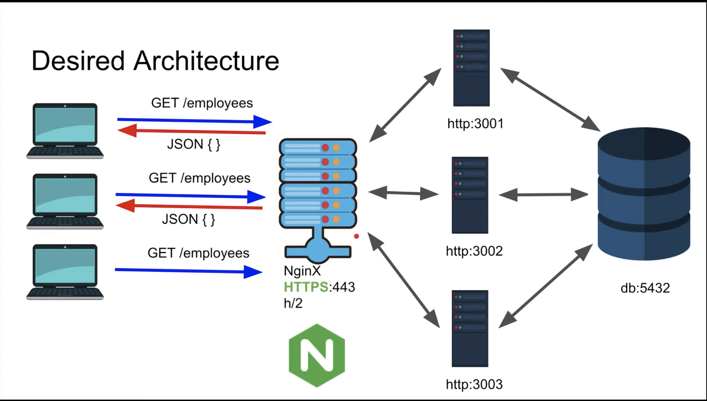

## <h1 style="text-align: center">Nginx</h1v>

- Web server & Proxy
  - Web server
    - Serves web content
  - Proxy
    - Load Balancing
    - Backend Routing
    - Caching
    - SSL ...



---

Layer 4 and Layer 7 proxying in Nginx

- Nginx can operate in Layer 7 (http) or Layer 4 (tcp)
- Using **stream** context :arrow_right: layer 4 proxy
- Using **http** context :arrow_right: layer 7 proxy

---

## Installation

on mac.

```bash
brew install nginx
```

command above will install files in `/usr/local/etc/nginx` and `nginx.conf`

After modifying `/usr/local/etc/nginx/nginx.conf` and run

```bash
nginx
```

It will execute the nginx page. (in my first example, `localhost:8080` will work fine)

<br/>

---

| Description  | Command           |
| ------------ | ----------------- |
| Stop nginx   | `nginx -s stop`   |
| Reload nginx | `nginx -s reload` |
